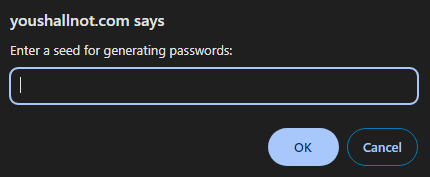
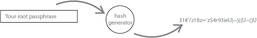
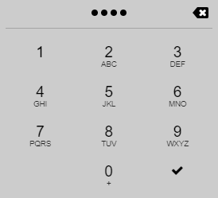
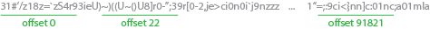

# You Shall Not (pass)

## A weird ass approach to password management 

What is this sorcery?
0 Knowledge
The App uses 0 storage, no databases, no server calls. Your passwords aren't stored anywhere

Determinism Based
Utilizes determinism to generate the same cryptic sequence based on a hash

How It Works
Step 1

You'll be prompted to enter a root keyword

Step 2

The root pass phrase will be used to generate a random hash of cryptographically secure characters

Step 3

Enter a PIN of up to 4 numbers to generate an offset

Step 4

16 characters will be selected based on the offset you provide

If you provide offset 0, you will get the first 16 characters

However, considering the string is HUGE, you can pick offsets such as 91982, 192021, or any other offset that you can represent/remember as a PIN

Give it a try for yourself!
Give it a try, check out the source code, do whatever, I'm not your mom.